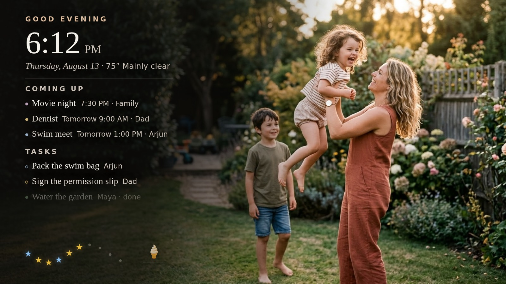
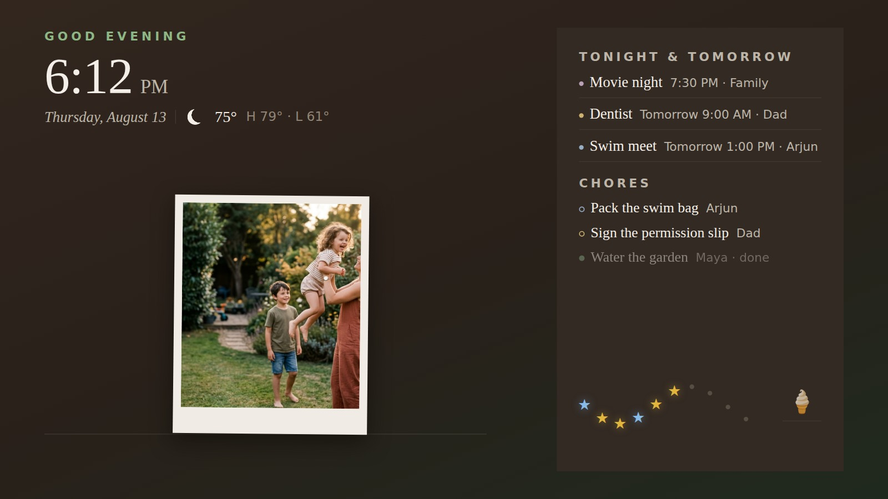
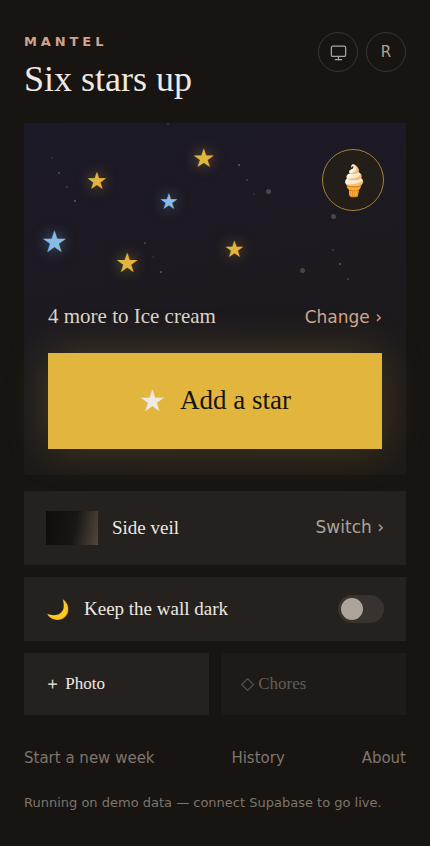

<div align="center">

# Mantel

### Your family's week, hanging on the wall like it belongs there.

Not a dashboard. Not a smart display with an app store. A quiet, gallery-grade
screen that shows what's happening today — and gets out of the way.

</div>



<div align="center">

**Runs on your TV. Controlled from your phone. No server to maintain.**

```bash
git clone https://github.com/jigripokri/mantel-wall.git
cd mantel-wall && npm install && npm run dev
```

**That's it.** Open <http://localhost:5000/tv> and the wall above is on your screen —
no account, no database, no API key. It ships with mock data so you can decide
whether you want it before you sign up for anything.

</div>

---

## The tenth star

Every week, a child collects stars — for brushing, for tidying, for being kind.
A parent taps one from the couch and says why. Fill the row, and the whole wall
stops what it's doing:


Nine seconds, once a week, across all 1920×1080. Then it goes quiet again.

It's additive only — there is no "take a star away," because the research on
reward charts is unambiguous that removal backfires. A fresh week is the only
way stars come down.

---

## Two screens, one household

<table>
<tr>
<td width="62%">



**The wall** — `/tv`

Three layouts ship. *Side veil* is one photo, dark, with a quiet column of type.
*Oat & moss* is a daylight family board that goes walnut after dark. *The stack*
hangs one photo forward with two peeking behind.

Switch between them from your phone. The wall repaints instantly.

</td>
<td width="38%">



**The phone** — `/`

Tap a star. Upload a photo. Change the week's reward. Put the wall to sleep.

Add it to your home screen and it's an app.

</td>
</tr>
</table>

---

## What it actually does

- **Calendar** — subscribes to your ICS feeds, expands recurrences, and colour-codes
  each event by person from a `Name: ` title prefix. Refreshes every 15 minutes on
  its own.
- **Star bank** — the weekly reward chart above. Stars are tinted by who gave them,
  and each one keeps the reason it was given.
- **Photos** — the family uploads from a phone; they rotate on the wall behind the
  type, resized and oriented on the way in.
- **Weather**, **chores**, and a freshness signal — so a sync that quietly died
  can't masquerade as an empty week.
- **Dark by day** — one toggle keeps the wall asleep while nobody's home.

Everything lands in a single `entries` table and renders as a tile. Adding a new
kind of thing to the wall is an afternoon, not a project.

## Why you might actually run this

**It costs nothing.** Supabase free tier, Vercel free tier, and a Raspberry Pi you
probably already own. No subscription, no account with a company that might pivot.

**It's yours.** MIT licensed. Your calendar never touches anyone's server but
Supabase's, your photos live in your own storage bucket behind signed URLs, and
the wall is `noindex` at three layers.

**It's private by construction.** The family allowlist is enforced in the database,
not the UI — signing in is not the same as being allowed in. An unlisted visitor
who completes a login sees exactly zero rows.

**Nothing is hardcoded to my family.** Every name lives in one file. Which brings us to —

## Make it yours in about a minute

Open [`src/config/family.ts`](src/config/family.ts), set who's in your household,
and you're done. It's the only place a person is named.

Using [Claude Code](https://claude.com/claude-code)? Two slash commands ship with
the repo:

| | |
| --- | --- |
| **`/setup`** | Interviews you, rewrites the config, verifies, shows you the wall. No accounts needed. |
| **`/provision`** | Drives the whole Supabase + Vercel deployment, stopping to hand you the browser for the logins it can't do. |

Prefer to do it by hand? **[`SETUP.md`](SETUP.md)** is the same thing as a runbook —
four stages, and you can stop after any of them.

## Built for a TV, honestly

Designed against a Samsung Frame 75", but any screen works — `/tv` is a fixed
1920×1080 stage that scales to fit. The type is sized to be read across a room,
not from a desk chair. Point a Raspberry Pi's Chromium at it in kiosk mode and
forget it exists; it signs in once and stays signed in for months.

## Under the hood

React 19 · Vite · TypeScript · Tailwind v4 · Supabase (Postgres, RLS, Auth,
Storage, Realtime, Edge Functions). Ingest runs as Deno Edge Functions on a cron.
**There is no server to write or run.**

| Command | |
| --- | --- |
| `npm run dev` | Dev server on :5000 |
| `npm run verify` | typecheck → lint → test → build. The gate. |
| `npm run db:push` | Apply migrations to your Supabase project |

Tests run twice, under `TZ=UTC` and `TZ=America/Los_Angeles`. That isn't
decoration: ingest runs in Deno under UTC and the wall runs on a Pi in your
living room, so anything derived from the host's zone diverges between them
silently.

## Docs

- **[`SETUP.md`](SETUP.md)** — fork → configure → deploy → hang on a wall.
- [`MODULES.md`](MODULES.md) — the Feature Module contract. Read before adding a feature.
- [`CLAUDE.md`](CLAUDE.md) — how to work in this repo, for humans and agents.
- [`CONTRIBUTING.md`](CONTRIBUTING.md) — issues and PRs welcome.
- [`tasks/`](tasks/) — self-contained feature specs, and a template for your own.
- [`docs/PHOTO-PROMPTS.md`](docs/PHOTO-PROMPTS.md) — prompts for generating demo photos
  that survive the veil. The wall is a photograph with a dark scrim over its left
  third, which constrains a good image more than taste does.
- [`docs/social/`](docs/social/) — share images, regenerated from the real app.

---

<div align="center">

**MIT licensed.** Fork it, rename the family, hang it on your own wall.

<sub>Screenshots are the real app on mock data. The people in them are
AI-generated and do not exist — no real family photo is committed to this
repository, ever.</sub>

</div>
